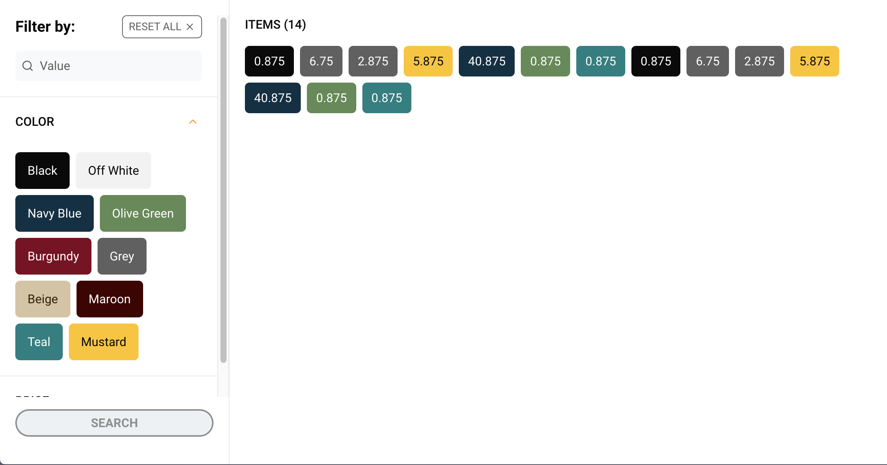

# Filter by color and price

<h1 align="center">
  
</h1>

> Projeto desenvolvido para praticar alguns conceitos de ReactJS e Typescript. Todo o código foi desenvolvido a partir de protótipo do [Figma](https://www.figma.com/file/ZmToweBS4dlMaYk5a9AyRk/Filter-by-color-and-price?type=design&node-id=2%3A253&mode=design&t=QjqjLaT2YpMXcMra-1). A ideia da aplicação é ser um filtro de produtos.  
>

## 💻 Pré-requisitos

Antes de começar, verifique se você atendeu aos seguintes requisitos:

- Você tem uma máquina `<Windows / Linux / Mac>`.
- Você tem o [git](https://git-scm.com) instalado na sua máquina.
- Você tem o [node](https://nodejs.org/en/) instalado na sua máquina.
- Você tem algum `browser` instalado na sua máquina.

## 🚀 Instalando Filter by color and price

Para instalar o Filter by color and price, siga estas etapas:

bash:

```
# Clone este repositório
$ git clone <https://github.com/caiohbfurtado/filter-by-color-and-price>
# Acesse a pasta do projeto no terminal/cmd
$ cd filter-by-color-and-price
# Instale as dependências
$ npm install ou yarn install
```

## ☕ Usando Filter by color and price

Para usar Filter by color and price, siga estas etapas:

bash:

```
# Acesse a pasta do projeto no terminal/cmd
$ cd ignite-teams
# Execute o servidor da aplicação
$ json-server --watch server.json
# Execute a aplicação em modo de desenvolvimento
$ npm run dev ou yarn dev
# O servidor inciará na porta:5173
```

### 🛠 Tecnologias

As seguintes ferramentas foram usadas na construção do projeto:

- [React](https://react.dev/)
- [TypeScript](https://www.typescriptlang.org/)
- [Tailwind CSS](https://tailwindcss.com/)
- [Radix UI](https://www.radix-ui.com/)
- [Axios](https://axios-http.com/)

### 👨🏾‍💻 Autor

---

 

Feito com ❤️ por Caio Furtado 👋🏽 Entre em contato!

[](https://www.linkedin.com/in/caiohbfurtado/)
[](mailto:caiohbfurtado@gmail.com)
